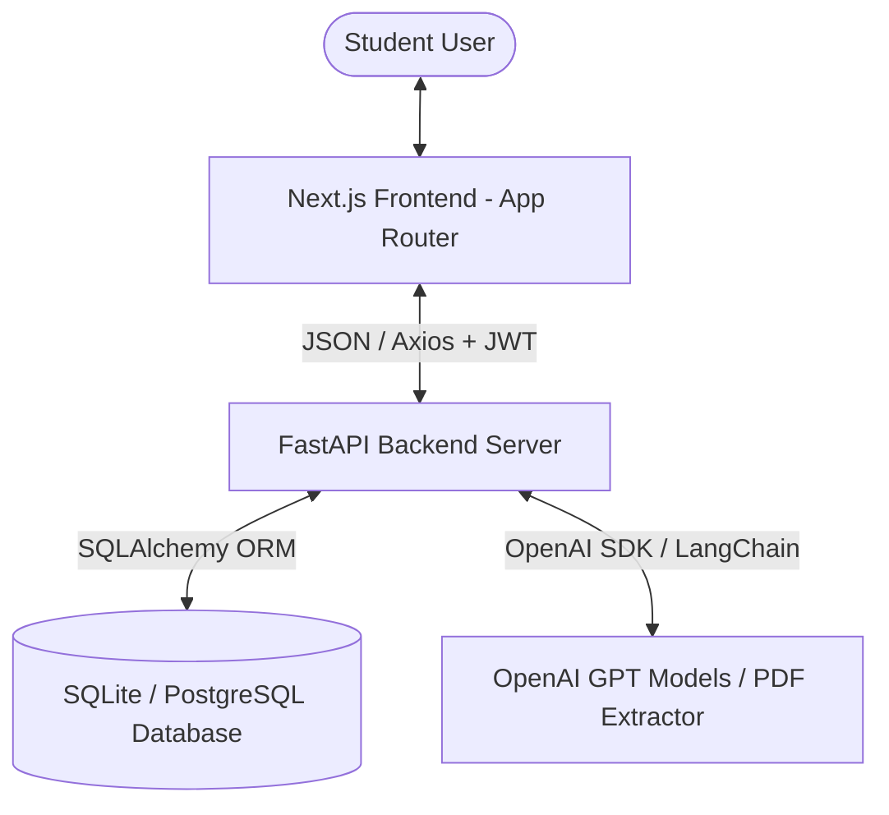
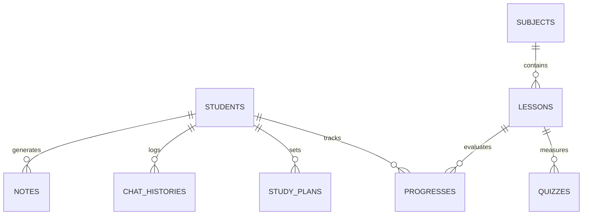

# System Architecture - AI Personal Tutor Agent

## Overview

The **AI Personal Tutor Agent** is a full-stack, decoupled Web application consisting of:
1. **Frontend**: Next.js 15 App Router + React 19 + TypeScript + Tailwind CSS + Framer Motion.
2. **Backend**: FastAPI (Python 3.11) REST API + SQLAlchemy ORM + SQLite/PostgreSQL.
3. **AI Engine**: OpenAI API / LangChain with prompt engineering & mock fallbacks.

## Component Diagram

## Database Schema

